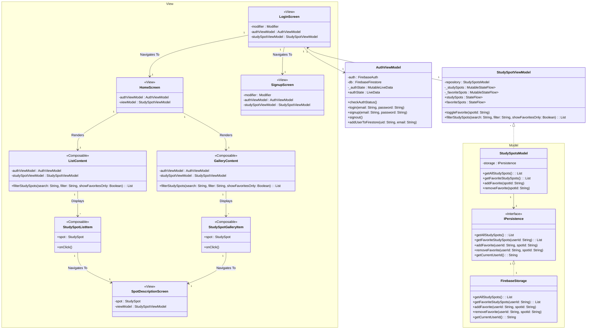

# Study Spotz

## Description
StudySpotz is an app for all University of Waterloo students looking for study spots on campus, allowing students to find new study spots based on personal preferences. It's often difficult to know the details of a study spot, visualize it, or locate it without having gone there first, so our app provides all of that information in one place. 

## Screenshots

  
  
  
  
  
  
  

## Members
- Keta Khatri (k3khatri@uwaterloo.ca)
- Abirami Karthikeyan (a8karthi@uwaterloo.ca)
- Yzabelle Perez (yperez@uwaterloo.ca)
- Grace Xu (g55xu@uwaterloo.ca)
- Julianne Jorda (rjjorda@uwaterloo.ca)

## Documents
- [Design Diagrams](https://git.uwaterloo.ca/k3khatri/team101-5/-/wikis/Design-Proposal) 
- [User Documentation](https://git.uwaterloo.ca/k3khatri/team101-5/-/wikis/User-Documentation) 
- [Version 1.0.0 Release](https://git.uwaterloo.ca/k3khatri/team101-5/-/wikis/Version-1.0.0-Release-)
- [Version 1.2.0 Release](https://git.uwaterloo.ca/k3khatri/team101-5/-/wikis/Version-1.2.0-Release)
- [Version 1.3.0 Release](https://git.uwaterloo.ca/k3khatri/team101-5/-/wikis/Version-1.3.0-Release)
- [Version 2.0.0 Release](https://git.uwaterloo.ca/k3khatri/team101-5/-/wikis/Version-2.0.0-Release)

## Project Proposal
[Project Proposal](Project_Proposal.pdf)

## Design Proposal
[Design Proposal](Design_Proposal.pdf)

## Release
[Version 1.0.0 Release](https://git.uwaterloo.ca/k3khatri/team101-5/-/wikis/Version-1.0.0-Release-) 
[Version 1.2.0 Release](https://git.uwaterloo.ca/k3khatri/team101-5/-/wikis/Version-1.2.0-Release)
 
[Version 1.3.0 Release](https://git.uwaterloo.ca/k3khatri/team101-5/-/wikis/Version-1.3.0-Release)
 
[Version 2.0.0 Release](https://git.uwaterloo.ca/k3khatri/team101-5/-/wikis/Version-2.0.0-Release)

## Team Contract
- Location: MC 3008 or MC 3005. First person to arrive can decide and let the team know. 
- Any absences or lates should be communicated by emails.
- General communication will be done through Discord.
- Major decision are to be made by the team using a majority voting system.
- Team Roles: 
    - **Keta**: Technical Lead
    - **Abirami**: Project Lead
    - **Yzabelle**: Backend Design Lead
    - **Grace**: Frontend Design Lead
- Git Rules:
    - Code in individual branches: #ISSUE-Feature-Description
    - Once ready to merge, get 2 approvals. 
    - Assign your PRs to yourself

## Diagram

