# Study Spotz

## Description
The app is aimed towards all University of Waterloo students looking for study spots on campus.
It will be a great resource for students looking to explore new study spots whether it's for individual or group study. It is often difficult to know details about the spot without being there, so this app will provide the necessary
information to the students. It will contain details about the location such as charging stations, projectors, and whiteboards. It is also difficult to
visualize and locate what the spot looks like, so the description will contain photos as well as
directions to the spot.

## Add Screenshots here

     

## Members
- Keta Khatri (k3khatri@uwaterloo.ca)
- Abirami Karthikeyan (a8karthi@uwaterloo.ca)
- Yzabelle Perez (yperez@uwaterloo.ca)
- Grace Xu (g55xu@uwaterloo.ca)
- Julianne Jorda (rjjorda@uwaterloo.ca)

## Documents
- [Meeting Minutes](https://git.uwaterloo.ca/k3khatri/team101-5/-/wikis/Meeting-Minutes)  
- [Design Diagrams](https://git.uwaterloo.ca/k3khatri/team101-5/-/wikis/Design-Diagrams) 
- [User Documentation](https://git.uwaterloo.ca/k3khatri/team101-5/-/wikis/User-Documentation) 
- [Project Reflections](https://git.uwaterloo.ca/k3khatri/team101-5/-/wikis/Project-Reflection)  
- [Version 1.0.0 Release](https://git.uwaterloo.ca/k3khatri/team101-5/-/wikis/Version-1.0.0-Release-) 
- [Version 1.2.0 Release](https://git.uwaterloo.ca/k3khatri/team101-5/-/wikis/Version-1.2.0-Release) 
- [Version 1.3.0 Release](https://git.uwaterloo.ca/k3khatri/team101-5/-/wikis/Version-1.3.0-Release)

## Project Proposal
[Project Proposal](Project_Proposal.pdf)

## Design Proposal
[Design Proposal](Design_Proposal.pdf)

## Release
[Version 1.0.0 Release](https://git.uwaterloo.ca/k3khatri/team101-5/-/wikis/Version-1.0.0-Release-) 
[Version 1.2.0 Release](https://git.uwaterloo.ca/k3khatri/team101-5/-/wikis/Version-1.2.0-Release)
 
[Version 1.3.0 Release](https://git.uwaterloo.ca/k3khatri/team101-5/-/wikis/Version-1.3.0-Release)

## Team Contract
- Wednesday and Friday during class times are mandatory. Meet Mondays after 4:00 PM EST as needed.
- Location: MC 3008 or MC 3005. First person to arrive can decide and let the team know. 
- Any absences or lates should be communicated by emails.
- General communication will be done through Discord.
- Major decision are to be made by the team using a majority voting system.
- Team Roles: 
    - **Keta**: Technical Lead
    - **Abirami**: Project Lead
    - **Yzabelle**: Backend Design Lead
    - **Grace**: Frontend Design Lead
- Git Rules:
    - Code in individual branches: #ISSUE-Feature-Description
    - Once ready to merge, get 2 approvals. 
    - Assign your PRs to yourself

## Diagram

```mermaid
classDiagram
  LoginScreen "1" --> "1" AuthViewModel
  LoginScreen "1" --> "1" HomeScreen : Navigates To
  LoginScreen "1" --> "1" SignupScreen : Navigates To
  LoginScreen "1" <-- "1" StudySpotViewModel
  StudySpotViewModel "*" <|.. "*" StudySpotsModel
  StudySpotsModel "1" --> "1" IPersistence
  IPersistence "1" <|.. "1" FirebaseStorage
  HomeScreen "1" --> "1" ListContent : Renders
  HomeScreen "1" --> "1" GalleryContent : Renders
  ListContent "1" --> "*" StudySpotListItem : Displays
  StudySpotListItem "1" --> "1" SpotDescriptionScreen : Navigates To
  StudySpotGalleryItem "1" --> "1" SpotDescriptionScreen : Navigates To
  GalleryContent "1" --> "*" StudySpotGalleryItem : Displays

  class LoginScreen {
    <<View>>
    -modifier : Modifier
    -authViewModel : AuthViewModel
    -studySpotViewModel : StudySpotViewModel

  }

  class AuthViewModel {
    -auth : FirebaseAuth
    -db : FirebaseFirestore
    -_authState : MutableLiveData<AuthState>
    +authState : LiveData<AuthState>
    +checkAuthStatus()
    +login(email: String, password: String)
    +signup(email: String, password: String)
    +signout()
    +addUserToFirestore(uid: String, email: String)
  }

  class HomeScreen {
    <<View>>
    -authViewModel : AuthViewModel
    -viewModel : StudySpotViewModel
  }

  class StudySpotViewModel {
    -repository : StudySpotsModel
    -_studySpots : MutableStateFlow<List<StudySpot>>
    -_favoriteSpots : MutableStateFlow<List<String>>
    +studySpots : StateFlow<List<StudySpot>>
    +favoriteSpots : StateFlow<List<String>>
    +toggleFavorite(spotId: String)
    +filterStudySpots(search: String, filter: String, showFavoritesOnly: Boolean) : List<StudySpot>
  }

  class StudySpotsModel {
    -storage : IPersistence
    +getAllStudySpots() : List<StudySpot>
    +getFavoriteStudySpots() : List<String>
    +addFavorite(spotId: String)
    +removeFavorite(spotId: String)
  }

  class IPersistence {
    <<Interface>>
    +getAllStudySpots() : List<StudySpot>
    +getFavoriteStudySpots(userId: String) : List<String>
    +addFavorite(userId: String, spotId: String)
    +removeFavorite(userId: String, spotId: String)
    +getCurrentUserId() : String
  }

  class FirebaseStorage {
    +getAllStudySpots() : List<StudySpot>
    +getFavoriteStudySpots(userId: String) : List<String>
    +addFavorite(userId: String, spotId: String)
    +removeFavorite(userId: String, spotId: String)
    +getCurrentUserId() : String
  }

  class ListContent {
    <<Composable>>
    -authViewModel : AuthViewModel
    -studySpotViewModel : StudySpotViewModel
    +filterStudySpots(search: String, filter: String, showFavoritesOnly: Boolean) : List<StudySpot>
  }

  class GalleryContent {
    <<Composable>>
    -authViewModel : AuthViewModel
    -studySpotViewModel : StudySpotViewModel
    +filterStudySpots(search: String, filter: String, showFavoritesOnly: Boolean) : List<StudySpot>
  }

  class StudySpotListItem {
    <<Composable>>
    +spot : StudySpot
    +onClick()
  }

  class SpotDescriptionScreen {
    <<View>>
    -spot : StudySpot
    -viewModel : StudySpotViewModel

  }

  class StudySpotGalleryItem {
    <<Composable>>
    +spot : StudySpot
    +onClick()
  }

  class SignupScreen {
    <<View>>
    -modifier : Modifier
    -authViewModel : AuthViewModel
    -studySpotViewModel : StudySpotViewModel
  }

```

